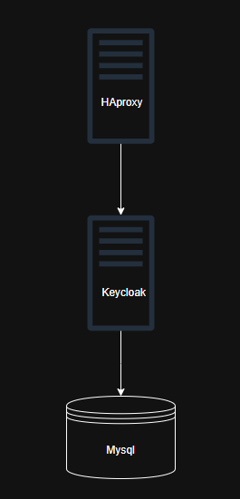
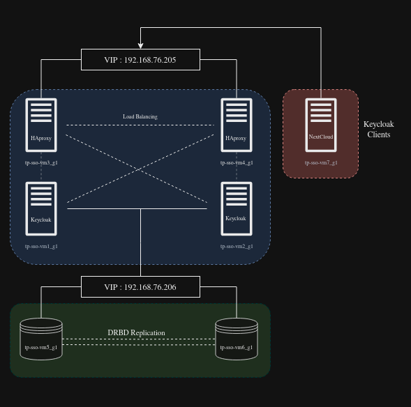
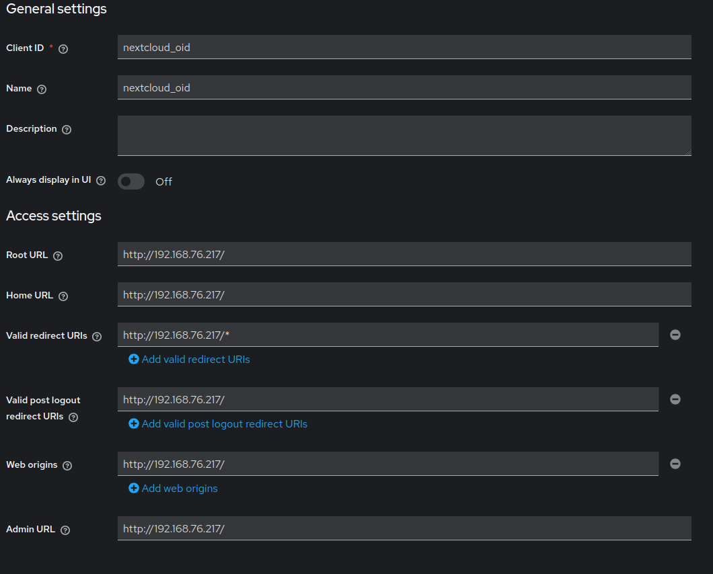
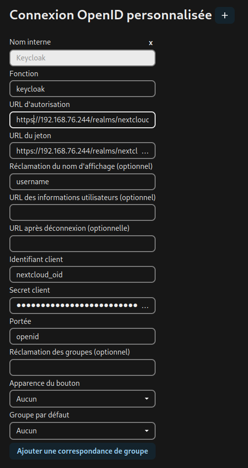
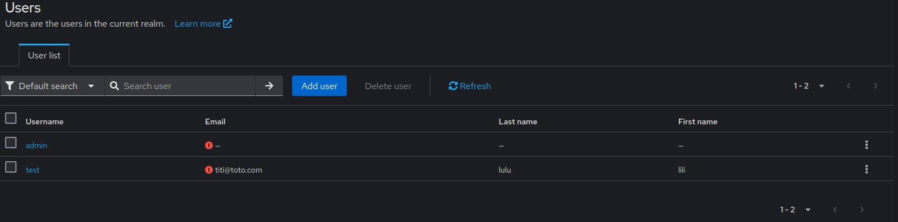
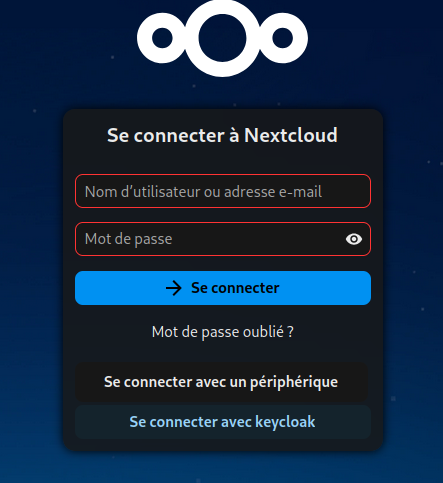
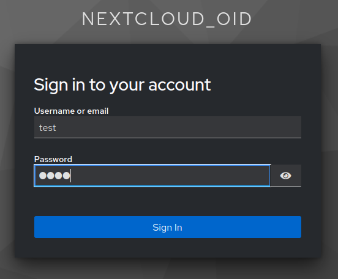
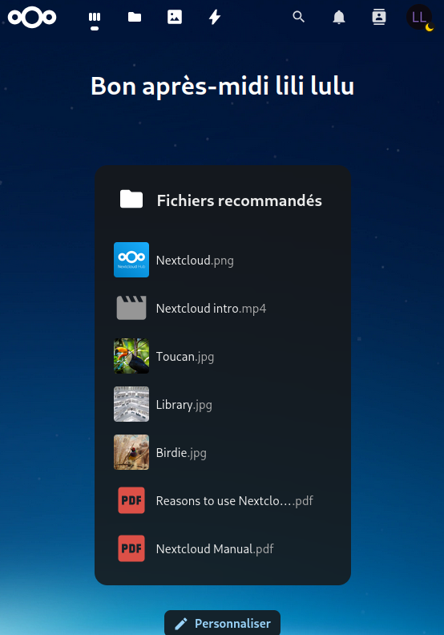

# LAB SSO

=================================================================

- Université Claude Bernard - Lyon 1
- M2 Systèmes, Réseaux et Sécurité
- Module : Sécurité Systèmes
- Année scolaire : 2024 - 2025

=================================================================

Par

1. Ass NIANG
2. Adrien CERVANTES
3. Mohamed HACHAMI
4. Mohamed-Aziz MOKADEM

=================================================================

# Table des matières

- [1. Déploiement Simple : Reverse Proxy, SSO et BDD](#1-déploiement-simple--reverse-proxy-sso-et-bdd)
  - [1.1. Architecture](#11-architecture)
  - [1.2. Configurations](#12-configurations)
    - [1.2.1. BDD](#121-bdd)
    - [1.2.2. Keycloak](#122-keycloak)
    - [1.2.3. HAProxy](#123-haproxy)
  - [1.3. Notre SSO est-il sécurisé ?](#13-notre-sso-est-il-sécurisé)

- [2. Déploiement en HA de notre infra ?](#2-déploiement-en-ha-de-notre-infra-)
  - [2.1. Architecture et Adressage](#21-architecture-et-adressage)
  - [2.2. Configuration des serveurs](#22-configuration-des-serveurs)
    - [2.2.1. BD SSO (MySQL)](#221-bd-sso-mysql)
    - [2.2.2. Keycloak](#222-keycloak)
    - [2.2.3. Load balancers](#2231-load-balancers)
  - [2.3. Sécurisation du SSO](#23-sécurisation-du-sso)
    - [2.3.1. Déployer Keycloak en HTTPS](#231-déployer-keycloak-en-https)
    - [2.3.2. Filtrer les échanges sur le réseau](#232-filtrer-les-échanges-sur-le-réseau)

- [3. Qu'est-ce qu'un Realm ?](#3-quest-ce-quun-realm)

- [4. Conception d'une architecture de sécurité](#4-conception-dune-architecture-de-sécurité)
  - [4.1. Architecture](#41-architecture)
  - [4.2. Description](#42-description)

- [Bonus 1 : Sécurisation de Nextcloud avec Keycloak](#bonus-1--sécurisation-de-nextcloud-avec-keycloak)
  - [B1.1. Déploiement de Nextcloud](#b11-déploiement-de-nextcloud)
  - [B1.2. Configurations dans Keycloak](#b12-configurations-dans-keycloak)
  - [B1.3. Configurations dans NextCloud](#b13-configurations-dans-nextcloud)
  - [B1.4. Test](#b14-test)

- [Bonus 2 : Déploiement et Intégration de LDAP](#bonus-2--déploiement-et-intégration-de-ldap)
  - [B2.1. Déploiement de LDAP](#b21-déploiement-de-ldap)
  - [B2.2. Intégration de LDAP dans le realm : nextcloud_oid](#b22-intégration-de-ldap-dans-le-realm--nextcloud_oid)
  - [B2.3. Test](#b23-test)
  - [B2.4. Limitations lors de l'intégration de l'annuaire](#b24-limitations-lors-de-lintégration-de-lannuaire)

- [Bonus 3 : Intégration avec Kerberos](#bonus-3--intégration-avec-kerberos)

# 1. Déploiement Simple : Reverse Proxy, SSO et BDD

## 1.1. Architecture



## 1.2. Configurations

### 1.2.1. BDD

- Installation de MySQL
    
    ```bash
    sudo apt-get update
    sudo apt-get install mysql-server -y
    ```
    
- Création de la BD Keycloak et de l’utilisateur `keycloak_usr`
    
    ```bash
    CREATE USER 'keycloak_usr'@'%' IDENTIFIED WITH mysql_native_password BY 'keycloak_pwd';
    CREATE DATABASE keycloak CHARACTER SET utf8 COLLATE utf8_unicode_ci;
    GRANT ALL PRIVILEGES ON keycloak.* TO 'keycloak_usr'@'%';
    FLUSH PRIVILEGES;
    ```
    
- Redémarrer le service MySQL
    
    ```bash
    sudo service mysql restart
    ```
    

### 1.2.2. Keycloak

- Unité systemd pour keycloak:
    
    ```yaml
    # /etc/systemd/system/keycloak.service
    [Unit]
    Description=The Keycloak Server
    After=syslog.target network.target
    
    # Hint: If Keycloak must be started before other services,
    # specify it like this:
    # Before=apache2.service
    
    [Service]
    User=keycloak
    Group=keycloak
    LimitNOFILE=102642
    PIDFile=/run/keycloak/keycloak.pid
    ExecStart=/opt/keycloak/bin/kc.sh -cf /etc/keycloak/keycloak.conf start
    
    [Install]
    WantedBy=multi-user.target
    ```
    
- Configuration du service :
    
    ```bash
    # /etc/keycloak/keycloak.conf
    db=mysql
    db-username=keycloak_usr
    db-password=keycloak_pwd
    db-url=jdbc:mysql://localhost/keycloak
    health-enabled=true
    metrics-enabled=true
    
    hostname-strict=false # pour accepter tous les hostnames et IPs disponibles
    http-enabled=true # pour accepter du http, écoute sur le port 8080 par défaut
    ```
    

### 1.2.3. HAProxy

- Installer HAProxy
    
    ```bash
    sudo apt install haproxy
    ```
    
- Modifier le fichier `/etc/haproxy/haproxy.cfg`
    
    ```bash
    sudo vim /etc/haproxy/haproxy.cfg
    ```
    
    ```hcl
    global
        log /dev/log  local0 warning
        chroot      /var/lib/haproxy
        pidfile     /var/run/haproxy.pid
        maxconn     4000
        user        haproxy
        group       haproxy
        daemon
    
        stats socket /var/lib/haproxy/stats
    
    listen stats
        bind :1936
        mode http
        stats enable
        stats hide-version
        stats realm Haproxy\ Statistics
        stats uri /
        stats auth admin:admin
    
    defaults
        log global
        option  httplog
        option  dontlognull
            timeout connect 5000
            timeout client 50000
            timeout server 50000
    
    frontend app
        bind *:80
        mode http
        default_backend backend
    
    backend backend
        mode http
        balance roundrobin
        timeout check 5000ms
        cookie SEROOCKIE insert indirect nocache
        server keycloak_01 192.168.76.220:8080 check cookie keycloak_01
    
    ```
    
- Redémarrer le service
    
    ```bash
    sudo systemctl restart haproxy
    ```
    

## 1.3. Notre SSO est-il sécurisé ?

Nous allons gérer la sécurisation du SSO après le déploiement en Haute Disponibilité du SSO

⇒ Voir : *2.3. Sécurisation du SSO*

# 2. Déploiement en HA de notre infra ?

Notre infrastructure bénéficie d’une redondance applicative mise en place par VRRP (via keepalived) et mise en place sur les load balancers (HAproxy) partageant la même VIP d'une part, et sur les machines fournissant le service MySQL d'autre part. 

## 2.1. Architecture et Adressage

- Architecture
    
    
    
- Adressage
    
    
    |  | Hostname | IPv4 | VIP |
    | --- | --- | --- | --- |
    | MySQL Master | tp-sso-vm5_g1 | 192.168.76.230 | 192.168.76.206 |
    | MySQL Slave | tp-sso-vm6_g1 | 192.168.76.201 | 192.168.76.206 |
    | Keycloak 1 | tp-sso-vm1_g1 | 192.168.76.220 |  |
    | Keycloak 2 | tp-sso-vm2_g1 | 192.168.76.233 |  |
    | HAProxy Master | tp-sso-vm3_g1 | 192.168.76.244 | 192.168.76.205 |
    | HAProxy Backup | tp-sso-vm4_g1 | 192.168.76.234 | 192.168.76.205 |
    | Nextcloud | tp-sso-vm7_g1 | 192.168.76.217 |  |
    | LDAP | tp-sso-vm8_g1 | 192.168.76.241 |  |

## 2.2. Configuration des serveurs

### 2.2.1. BD SSO (MySQL)

- Configuration des BDs  MySQL Master et Slave
    - Installation MySQL sur les 2 serveurs
        
        ```bash
        sudo apt-get update
        sudo apt-get install mysql-server -y
        ```
        
    - Master (`tp-sso-vm5_g1`)
        - Modifier le fichier de configuration `/etc/mysql/mysql.conf.d/mysqld.cnf`
        
        ```bash
        sudo vi /etc/mysql/mysql.conf.d/mysqld.cnf
        ```
        
        *(mettre à jour les lignes suivantes)*
        
        ```bash
        bind-address= 0.0.0.0 # Listen on all availables interfaces
        
        server-id= 1
        log_bin= /var/log/mysql/mysql-bin.log
        
        ```
        
        - Création de l’utilisateur slave
        
        ```bash
        sudo mysql -uroot
        ```
        
        ```sql
        CREATE USER 'repl'@'%' IDENTIFIED WITH mysql_native_password BY 'slavepassword';
        GRANT REPLICATION SLAVE ON *.* TO 'repl'@'%';
        FLUSH PRIVILEGES;
        ```
        
        
        
        - Création de la BD Keycloak et de l’utilisateur `keycloak_usr`
        
        ```bash
        CREATE USER 'keycloak_usr'@'%' IDENTIFIED WITH mysql_native_password BY 'keycloak_pwd';
        CREATE DATABASE keycloak CHARACTER SET utf8 COLLATE utf8_unicode_ci;
        GRANT ALL PRIVILEGES ON keycloak.* TO 'keycloak_usr'@'%';
        FLUSH PRIVILEGES;
        ```
        
        - Redémarrer le service MySQL
        
        ```bash
        sudo service mysql restart
        ```
        
        - Vérification
        
        ```bash
        sudo mysql -uroot
        ```
        
        ```sql
        SHOW MASTER STATUS;
        ```
        
        
        
        - Créer un dump du Master
        
        ```bash
        sudo mysqldump -uroot --all-databases --master-data > masterdump.sql
        ```
        
        
        
        - Copier le dump dans le Slave
        
        
        
    - Slave (`tp-sso-vm6_g1`)
        - Modifier le fichier de configuration `/etc/mysql/mysql.conf.d/mysqld.cnf`
        
        ```bash
        sudo vi /etc/mysql/mysql.conf.d/mysqld.cnf
        ```
        
        *(Mettre à jour les lignes suivantes)*
        
        ```bash
        bind-address= 0.0.0.0 # Listen on all availables interfaces
        
        server-id= 2
        log_bin= /var/log/mysql/mysql-bin.log
        relay-log= /var/log/mysql/mysql-relay-bin.log
        
        ```
        
        - Redémarrer le service MySQL
        
        ```bash
        sudo service mysql restart
        ```
        
        - Renseigner le Master et les identifiants d’accès
        
        ```bash
        sudo mysql -u root
        ```
        
        ```sql
        # "SHOW MASTER STATUS" dans le master et récupérer les valeurs des paramètres
        	# MASTER_LOG_FILE='mysql-bin.000001', MASTER_LOG_POS=157
        CHANGE MASTER TO MASTER_HOST='192.168.76.230', MASTER_USER='repl', MASTER_PASSWORD='slavepassword', MASTER_LOG_FILE='mysql-bin.000001', MASTER_LOG_POS=157;
        ```
        
        
        
        - Charger le *dump*
        
        ```bash
        sudo mysql -uroot < masterdump.sql
        ```
        
        - Démarrer le Slave
        
        ```bash
        sudo mysql -uroot
        ```
        
        ```sql
        START SLAVE;
        ```
        
        ```bash
        SHOW SLAVE STATUS\G;
        ```
        
        
        
- Configuration de Keepalived sur les serveurs de BD
    - Désactiver le *Port Security* pour les des VMs sur OpenStack
        - Edit Port Security Groups
        
        
        
        - Edit Port
        
        
        
        - Décocher le “Port Security” et Cliquer sur “Update”
        
        
        
    - Configuration de Keepalived (VIP : `192.168.76.206`)
        - Installer Keepalived sur les deux serveurs de BD (Master et Slave)
            
            ```bash
            sudo apt-get install keepalived -y
            ```
            
        - Master
            
            ```bash
            sudo vi /etc/keepalived/keepalived.conf
            ```
            
            *(Contenu du fichier)*
            
            ```hcl
            vrrp_script check_mysql {
                script "/usr/bin/systemctl is-active --quiet mysql"
                interval 2
                timeout 3
                rise 2
                fall 3
            }
            
            vrrp_instance VI_1 {
            
                state MASTER
                interface enp1s0
                garp_master_delay 10
                virtual_router_id 51
                priority 200
            
                virtual_ipaddress {
                    192.168.76.206/26
                }
                
                unicast_src_ip 192.168.76.230
                unicast_peer {
                    192.168.76.201
                }
            
                advert_int 1
            
                authentication {
                    auth_type PASS
                    auth_pass testpass
                }
                
                track_script {
                    check_mysql
                }
            
            #    notify_master "/etc/keepalived/notify.sh master"
            #    notify_backup "/etc/keepalived/notify.sh backup"
            #    notify_fault "/etc/keepalived/notify.sh fault"
            }
            
            ```
            
            - Redémarrer le service keepalived
            
            ```bash
            sudo systemctl restart keepalived
            ```
            
            ```bash
            sudo systemctl status keepalived
            ```
            
            
            
            - Vérifier si la VIP est bien configurée sur l’interface
            
            ```bash
            ip a
            ```
            
            
            
        - Slave
            
            ```bash
            sudo vi /etc/keepalived/keepalived.conf
            ```
            
            *(Contenu du fichier)*
            
            ```hcl
            vrrp_script check_mysql {
                script "/usr/bin/systemctl is-active --quiet mysql"
                interval 2
                timeout 3
                rise 2
                fall 3
            }
            
            vrrp_instance VI_1 {
            
                state BACKUP
                interface enp1s0
                garp_master_delay 10
                virtual_router_id 51
                priority 50
            
                virtual_ipaddress {
                    192.168.76.206/26
                }
                
                unicast_src_ip 192.168.76.201
                unicast_peer {
                    192.168.76.230
                }
            
                advert_int 1
            
                authentication {
                    auth_type PASS
                    auth_pass testpass
                }
                
                track_script {
                    check_mysql
                }
            
            #    notify_master "/etc/keepalived/notify.sh master"
            #    notify_backup "/etc/keepalived/notify.sh backup"
            #    notify_fault "/etc/keepalived/notify.sh fault"
            }
            
            ```
            
            - Redémarrer le service keepalived
            
            ```bash
            sudo systemctl restart keepalived
            ```
            
            ```bash
            sudo systemctl status keepalived
            ```
            
            
            

### 2.2.2 Keycloak

- Configuration Keycloak (sur les deux serveurs)
    - Unité systemd pour keycloak:
        
        ```yaml
        # /etc/systemd/system/keycloak.service
        [Unit]
        Description=The Keycloak Server
        After=syslog.target network.target
        
        # Hint: If Keycloak must be started before other services,
        # specify it like this:
        # Before=apache2.service
        
        [Service]
        User=keycloak
        Group=keycloak
        LimitNOFILE=102642
        PIDFile=/run/keycloak/keycloak.pid
        ExecStart=/opt/keycloak/bin/kc.sh -cf /etc/keycloak/keycloak.conf start
        ##ExecStart=/opt/keycloak/bin/kc.sh -cf /etc/keycloak/keycloak.conf start --hostname=tp-sso-vm1-g1 --http-enabled=true --o>
        #StandardOutput=null
        
        [Install]
        WantedBy=multi-user.target
        ```
        
    - Configuration du service :
        
        ```bash
        # /etc/keycloak/keycloak.conf
        db=mysql
        db-username=keycloak_usr
        db-password=keycloak_pwd
        db-url=jdbc:mysql://192.168.76.206/keycloak
        health-enabled=true
        metrics-enabled=true
        
        hostname-strict=false # pour accepter tous les hostnames et IPs disponibles
        http-enabled=true # pour accepter du http, écoute sur le port 8080 par défaut
        ```
        
    

### 2.3.1. Load balancers

- Configuration des HAProxy (`tp-sso-vm3-g1` et `tp-sso-vm4-g1`)
    - Installer HAProxy
        
        ```
        sudo apt install haproxy
        ```
        
    - Modifier le fichier de configuration `/etc/haproxy/haproxy.cfg`
        
        ```
        sudo vim /etc/haproxy/haproxy.cfg
        ```
        
        - Master
        
        ```bash
        global
            log /dev/log  local0 warning
            chroot      /var/lib/haproxy
            pidfile     /var/run/haproxy.pid
            maxconn     4000
            user        haproxy
            group       haproxy
            daemon
        
            stats socket /var/lib/haproxy/stats
        
        listen stats
            bind :1936
            mode http
            stats enable
            stats hide-version
            stats realm Haproxy\ Statistics
            stats uri /
            stats auth admin:admin
        
        defaults
            log global
            option  httplog
            option  dontlognull
                timeout connect 5000
                timeout client 50000
                timeout server 50000
        
        frontend app
            bind *:80
            mode http
            default_backend backend
        
        backend backend
            mode http
            balance roundrobin
            timeout check 5000ms
            cookie SEROOCKIE insert indirect nocache
            server keycloak_01 192.168.76.220:8080 check cookie keycloak_01
            server keycloak_02 192.168.76.233:8080 check cookie keycloak_02
        
        ```
        
        - Backup
        
        ```bash
        global
            log /dev/log  local0 warning
            chroot      /var/lib/haproxy
            pidfile     /var/run/haproxy.pid
            maxconn     4000
            user        haproxy
            group       haproxy
            daemon
        
           stats socket /var/lib/haproxy/stats
        
        listen stats
            bind :1936
            mode http
            stats enable
            stats hide-version
            stats realm Haproxy\ Statistics
            stats uri /
            stats auth admin:admin
        
        defaults
          log global
          option  httplog
          option  dontlognull
                timeout connect 5000
                timeout client 50000
                timeout server 50000
        
        frontend app
          bind *:80
          mode http
          default_backend backend
        
        backend backend
            mode http
            balance roundrobin
            timeout check 5000ms
            cookie SEROOCKIE insert indirect nocache
            server keycloak_01 192.168.76.220:8080 check cookie keycloak_01
            server keycloak_02 192.168.76.233:8080 check cookie keycloak_02
        
        ```
        
    - Redémarrer le service
        
        ```bash
        sudo systemctl restart haproxy
        ```
        
    - Configurer le noyau pour permettre au service d’écouter sur une IP non locale :
        
        ```bash
        sudo sysctl -w net.ipv4.ip_nonlocal_bind=1 
        ```
        
- Configuration Keepalived sur les serveurs HAProxy
    - Master:
    
    ```bash
    vrrp_script check_haproxy {
        script "/usr/bin/systemctl is-active --quiet haproxy"
        interval 2
    }
    
    vrrp_instance VI_1 {
    
        state MASTER
        interface enp1s0
        garp_master_delay 10
        virtual_router_id 51
        priority 200
    
        virtual_ipaddress {
            192.168.76.205/26
        }
        
        unicast_src_ip 192.168.76.244
        unicast_peer {
            192.168.76.234
        }
    
        advert_int 1
    
        authentication {
            auth_type PASS
            auth_pass testpass
        }
        track_script {
            check_haproxy
        }
    
    }
    
    ```
    
    - Backup:
    
    ```bash
    vrrp_script check_haproxy {
        script "/usr/bin/systemctl is-active --quiet haproxy"
        interval 2
    }
    
    vrrp_instance VI_1 {
    
        state BACKUP
        interface enp1s0
        garp_master_delay 10
        virtual_router_id 51
        priority 50
    
        virtual_ipaddress {
            192.168.76.205/26
        }
        
        unicast_src_ip 192.168.76.234
        unicast_peer {
            192.168.76.244
        }
    
        advert_int 1
    
        authentication {
            auth_type PASS
            auth_pass testpass
        }
    
    }
    
    ```
    
    - Script /etc/keepalived/notify.sh :
    
    ```bash
    #!/bin/bash
    
    vipAddress="192.168.76.205/26"
    
    if [[ "x$1" == "xmaster" ]]; then
    
     ip address add dev enp1s0 ${vipAddress}
    
    else
    
       ip address del dev enp1s0 ${vipAddress}
    
    fi
    
    ```
    
    - Décocher le `Port Security` dans les VMs (VM3 et VM4) sur OpenStack dans (Edit Port)
        
        *(Compute/Instances/tp-sso-vm3_g1/Interfaces/Edit Security Groups/Info)*
        
    
    
    

## 2.3. Sécurisation du SSO

Non notre infrastructure n’est pas bien sécurisée, en effet les segments assurant la liaison entre les proxys et les applications keycloaks ne sont pas chiffrées et transittent donc en clair, il en est de même pour les transits mysql. Idéalement, il nous faudrait séparer les applicatifs et renforcer le proxy (firewall Applicatif), puis mettre en place des communications HTTPS entre les applicatifs.

### 2.3.1. Déployer Keycloak en HTTPS

**A. Par défaut, on a du HTTP…**

- Page d’accueil en HTTP
    
    
    

**B. Openssl**

- Générer la clé et le certificat avec Openssl
    
    ```bash
    openssl req -x509 -nodes -days 365 -newkey rsa:2048 -keyout kc.key.pem -out kc.crt.pem
    ```
    
    
    

**C. Keycloak**

- Placer la clé et le certificat dans le dossier de config du service Keycloak (sur les deux serveurs)
    
    ```bash
    sudo mv kc.* /etc/keycloak/
    ls -l /etc/keycloak/
    ```
    
    - Serveur Keycloak 1
    
    
    
    - Serveur Keycloak 2
    
    
    
- Mettre à jour le fichier de configuration de Keycloak (sur les deux serveurs)
    
    ```bash
    sudo vi /etc/keycloak/keycloak.conf
    ```
    
    *Les paramètres…*
    
    ```hcl
    # The file path to a server certificate or certificate chain in PEM format.
    https-certificate-file=/etc/keycloak/kc.crt.pem
    
    # The file path to a private key in PEM format.
    https-certificate-key-file=/etc/keycloak/kc.key.pem
    
    # Hostname for the Keycloak server.
    #hostname=192.168.76.206
    hostname-strict=false # accepter tous les hostnames et IP disponibles
    #https-port=443 # par défaut, keycloak écoute sur le port 8443
    #http-enabled=true # par défaut, http n'est pas activé
    ```
    
- Redémarrer le service keycloak (sur les deux serveurs)
    
    ```bash
    sudo systemctl restart keycloak.service
    sudo systemctl status keycloak.service
    ```
    
    - Serveur Keycloak 1
    
    
    
    - Serveur Keycloak 2
    
    
    
    - Problèmes résolus
        - Permissions `/etc/keycloak/kc.key.pem`
        
        ```hcl
        chmod 644 /etc/keycloak/kc.key.pem
        ```
        
        - Chargement de la page keycloak
        
        ```hcl
        sudo journalctl -u keycloak -n 40 | cat
        ```
        
        
        
        ```bash
        sudo chown -R keycloak:keycloak /opt/keycloak/data/tmp/kc-gzip-cache
        sudo chmod -R 755 /opt/keycloak/data/tmp/kc-gzip-cache
        ```
        

**D. HAProxy et Keepalived**

- Copier la clé privée et le certificat dans les serveurs HAProxy, puis les combiner dans un seul fichier `/etc/haproxy/kc.pem` (HAProxy ne prend qu’un seul fichier)
    
    ```bash
    cat kc.crt.pem kc.key.pem > kc.pem
    sudo mv kc.pem /etc/haproxy/
    ```
    
- Mettre à jour la configuration du service HAProxy
    
    ```bash
    sudo vi /etc/haproxy/haproxy.cfg
    ```
    
    ```bash
    # lines omitted...
    frontend app
    	bind *:443 ssl crt /etc/haproxy/kc.pem # ssl -> déchiffrer, crt -> localiser la clé+certificat
    	# lines omitted...
    
    backend backend
    	# lines omitted...
    	# ssl -> chiffrer avant d'envoyer au backend, verify none -> parce que pas de CA (self-signed)
    	server keycloak_01 192.168.76.220:8443 check cookie keycloak_01 ssl verify none 
    	server keycloak_02 192.168.76.233:8443 check cookie keycloak_02 ssl verify none
    ```
    
- Redémarrer les services HAProxy et Keepalived
    
    ```hcl
    sudo systemctl restart haproxy
    sudo systemclt status haproxy
    
    sudo systemctl restart keepalived
    sudo systemclt status keepalived
    ```
    
    - Master
    
    
    
    
    
    - Backup
    
    
    
    
    

**E. Maintenant, on a aussi du HTTPS**

- Page d’accueil en HTTPS
    
    
    

### 2.3.2. Filtrer les échanges sur le réseau

Idéalement, on aurait opté pour une architecture avec 3 zones : réseau interne, DMZ et internet. On aurait mis les serveurs HAProxy et Keycloak dans la DMZ, et les serveurs de base de données MySQL dans le réseau interne. On mettrait aussi en place 2 pare-feux : un pare-feu externe pour filtrer le trafic destiné au DMZ et un pare-feu interne pour filtrer le trafic entre le DMZ et le réseau interne. Enfin, on déploierait aussi un WAF (web application firewall) entre le pare-feu externe et les HAProxy pour bloquer (tout) le trafic web malveillant. 

Mais pour des raisons de simplicité et de limitation des ressources à notre disposition, nous allons juste configurer les pares-feux personnels (Host-based firewall) au niveau des serveurs.

**A. Matrice de flux entre les VMs**

Afin de réduire la surface d’attaque, nous avons mis en place des mesures préventives en n’autorisant que le trafic nécessaire. Tout le reste sera bloqué.

<aside>
💡

Juste noter que le port 22 sera ouvert sur toutes les VMs pour que tous les membres du groupe puissent y accéder par SSH.

</aside>

|  |  | Destination | Destination | Destination | Destination |
| --- | --- | --- | --- | --- | --- |
|  |  | Internet | HAProxy | Keycloak | MySQL |
| Source | Internet |  | Allow only https (dport 443) | Deny All | Deny All |
| Source | HAProxy | Allow only Established https (sport 443) | Allow Keepalived traffic | Allow only https (dport 8443) | Deny All |
| Source | Keycloak | Deny All | Allow all Established https (sport 8443) | Deny All | Allow only tcp (dport 3306) |
| Source | MySQL | Deny All | Deny All | Allow only Established (sport 3306) | Allow Keepalived traffic |

|  | Hostname | IPv4 | VIP |
| --- | --- | --- | --- |
| MySQL Master | tp-sso-vm5_g1 | 192.168.76.230 | 192.168.76.206 |
| MySQL Slave | tp-sso-vm6_g1 | 192.168.76.201 | 192.168.76.206 |
| Keycloak 1 | tp-sso-vm1_g1 | 192.168.76.220 |  |
| Keycloak 2 | tp-sso-vm2_g1 | 192.168.76.233 |  |
| HAProxy Master | tp-sso-vm3_g1 | 192.168.76.244 | 192.168.76.205 |
| HAProxy Backup | tp-sso-vm4_g1 | 192.168.76.234 | 192.168.76.205 |
| Nextcloud | tp-sso-vm7_g1 | 192.168.76.217 |  |
| LDAP | tp-sso-vm8_g1 | 192.168.76.241 |  |

**B. Configuration des serveurs**

Pour ne pas rallonger davantage le rapport, nous allons juste mette les configurations du serveur HAProxy Master sachant que l’idée est la même pour les autres serveurs.

- Cas du HAProxy Master
    
    
    | Service | Interface (sens) | Protocol | Src IP | Src Port | Dst IP | Dst Port | Etat | Action |
    | --- | --- | --- | --- | --- | --- | --- | --- | --- |
    | SSH | IN | TCP | ANY | ANY | 192.168.76.244 | 22 | NEW | ALLOW |
    | SSH | OUT | TCP | 192.168.76.244 | 22 | ANY | ANY | ESTABLISHED | ALLOW |
    | VRRP | IN | VRRP | 192.168.76.234 |  | 192.168.76.244 |  |  | ALLOW |
    | VRRP | OUT | VRRP | 192.168.76.244 |  | 192.168.76.234 |  |  | ALLOW |
    | VRRP | IN | VRRP |  |  | 224.0.0.0/8 |  |  | ALLOW |
    | HTTPS | IN | TCP | ANY | ANY | 192.168.76.205 | 443 | NEW | ALLOW |
    | HTTPS | OUT | TCP | 192.168.76.205 | 443 | ANY | ANY | ESTABLISHED | ALLOW |
    | HTTPS | OUT | TCP | 192.168.76.205 | ANY | 192.168.76.220,192.168.76.233 | 8443 | NEW | ALLOW |
    | HTTPS | IN | TCP | 192.168.76.220,192.168.76.233 | 8443 | 192.168.76.205 | ANY | ESTABLISHED | ALLOW |
    |  | IN |  | ANY |  | ANY |  |  | DROP |
    |  | OUT |  | ANY |  | ANY |  |  | DROP# Pour  |
    
    ```bash
    # Pour SSH
    sudo iptables -A INPUT -p tcp --dport 22 -j ACCEPT
    sudo iptables -A OUTPUT -p tcp --sport 22 -m state --state ESTABLISHED -j ACCEPT
    
    # Pour Keepalived
    sudo iptables -A INPUT -p vrrp -s 192.168.76.234 -d 192.168.76.244 -j ACCEPT
    sudo iptables -A OUTPUT -p vrrp -s 192.168.76.244 -d 192.168.76.234 -j ACCEPT
    sudo iptables -A INPUT -p vrrp -d 224.0.0.0/8 -j ACCEPT
    
    # Pour HTTPS (client -> HAProxy)
    sudo iptables -A INPUT -p tcp -d 192.168.76.205 --dport 443 -j ACCEPT
    sudo iptables -A OUTPUT -p tcp -s 192.168.76.205 --sport 443 -m state --state ESTABLISHED -j ACCEPT
    
    # Pour HTTPS (HAProxy -> Keycloak1,Keycloak2)
    sudo iptables -A OUTPUT -p tcp -s 192.168.76.205 -d 192.168.76.220,192.168.76.233 --dport 8443 -j ACCEPT
    sudo iptables -A INPUT -p tcp -s 192.168.76.220,192.168.76.233 -d 192.168.76.205 --sport 8443 -m state --state ESTABLISHED -j ACCEPT
    
    #134.214.188.160
    
    # Par défaut
    sudo iptables -P INPUT DROP
    sudo iptables -P OUTPUT DROP
    ```
    
- liens utiles
    - cf. → Cours Sécurité Réseaux (p.176, p.224, p.225)
    - FW VM OpenSource (`pfSense` or `OPNsense`)
        
        https://www.youtube.com/watch?v=gLA1a7Xn924&list=PLCQ7UEq6XQ1GRtKpOkfxW6Oc_2VxkmRVc
        
        https://docs.opnsense.org/manual/install.html
        
        *→ Keepalived traffic*
        
        https://stackoverflow.com/questions/12908701/keepalived-works-well-without-iptables
        
        https://www.linuxquestions.org/questions/linux-newbie-8/what-is-the-keepalived-iptables-port-4175541899/#post5359951
        
        *→ MySQL traffic*
        
        https://www.cyberciti.biz/tips/linux-iptables-18-allow-mysql-server-incoming-request.html
        
        *→ HAProxy traffic*
        
        https://serverfault.com/questions/693484/configuring-iptables-for-haproxy
        
        https://community.spiceworks.com/t/haproxy-and-issues-with-iptables/481597/3
        

# 3. Qu’est-ce qu’un Realm ?

Un realm est un concept fondamental introduit par keycloak, il permet de hiérarchiser les différents groupes le constituant tels que les Utilisateurs, les Clients ainsi que les droits et les roles de chacuns. Cela permet également de segmenter à un niveau plus élevé la gestion des domaines gérés.


# 4. Conception d’une architecture de sécurité

## 4.1. Architecture


## 4.2. Description

Un seul Realm principal sera utilisé pour centraliser la gestion des identités et des accès. Chaque application (ERP, eCommerce, logiciel de paie) est configurée dans le Realm principal.

Pour les fédérations on crée une fédération pour l’ AD pour intégrer les comptes internes. Et une autre pour la base de données Mysql et donc les utilisateurs externes. Ces fédération seront utilisées pour pour importer les différents utilisateurs.

Définissant les rôles spécifiques pour chaque client:

**ERP:**

- ERP_Admin: gestion complète
- ERP_User: Utilisateur standard

**eCommerce:**

- eCommerce_Admin: gestion de la boutique en ligne
- eCommerce_User: utilisateur interne et externe accédant à la boutique

**Logiciel de paie:**

- Payroll_Admin: gestion complète
- Payroll_User: consultation des fiches de paie

**Politiques de sécurité**

- Authentification multi-facteurs (MFA)
- Activer l’authentification multi facteurs (MFA) pour les utilisateurs ayant accès aux applications.
- Renforcer les exigences de mot de passe (longueur, complexité)
- Définir une durée de session adaptée pour chacune des applications

# Bonus 1 : Sécurisation de Nextcloud avec Keycloak

https://www.aukfood.fr/comment-nous-avons-cree-une-architecture-sso-nextcloud-keycloak-yubikey/

Pour la configuration de nextcloud et keycloak 

## B1.1. Déploiement de Nextcloud

- Installation de NextCloud
    
    ```bash
    sudo apt update
    sudo apt install apache2 -y
    sudo systemctl status apache2
    
    sudo apt install php libapache2-mod-php php-imagick php-common php-mysql php-gd php-json php-curl php-zip php-xml php-mbstring php-bz2 php-intl php-bcmath php-gmp php-dom unzip -y
    php -v
    sudo systemctl reload apache2
    
    sudo apt install mariadb-server -y
    # sudo mysql_secure_installation
    
    sudo mysql -u root -p
    CREATE DATABASE nextcloud_db;
    GRANT ALL ON nextcloud_db.* TO 'nextcloud_usr'@'localhost' IDENTIFIED BY 'nextcloud_pwd';
    FLUSH PRIVILEGES;
    
    mysql -u nextcloud_usr -p
    exit;
    
    wget https://download.nextcloud.com/server/releases/nextcloud-23.0.0.zip
    sudo unzip nextcloud-23.0.0.zip -d /var/www/html/ 
    sudo mkdir /var/www/html/nextcloud/data 
    sudo chown -R www-data:www-data /var/www/html/nextcloud/
    
    ```
    
- Installation de l’application social user sur nextcloud
    
    ```bash
    sudo -u www-data php occ app:install social_login
    ```
    

## B1.2. Configurations dans Keycloak

- Configuration du nouveau client dans keycloak
    - Client ID : nextcloud_oid
    - Name : nextcloud_oid
    - Client Protocol : openid-connect
    - Access settings:
        - Root URL : http://192.168.76.217/
        - Valid Redirect URIs : http://192.168.76.217/*
        - Base URL : http://192.168.76.217/
        - Admin URL : http://192.168.76.217/
        - Web Origins : http://192.168.76.217/
    - Capability Config
        - Client Authentication : Enabled
    
    
    
    <aside>
    💡
    
    Copier le `Client Secret` depuis l’onglet `Credentials`
    
    </aside>
    
    
    

## B1.3. Configurations dans NextCloud

- Configuration de l’application dans nextcloud
    - Authorize URL : https://192.168.76.244/realms/nextcloud_oid/protocol/openid-connect/auth
    - Token URL : https://192.168.76.244/realms/nextcloud_oid/protocol/openid-connect/token
    - Client ID : nextcloud
    - Client Secret : `LeSecretRecupereSurKeycloak`
    - Scope : openid
    
    
    
    <aside>
    💡
    
    Bien noter que l’intégration avec l’IP virtuelle ne fonctionne pas (problème OpenStack == “connection refused”), donc la configuration s’adresse directement au serveur keycloak n°1.
    
    </aside>
    

## B1.4. Test

- Connexion à Nextcloud à travers Keycloak
    1. Créer un user dans keycloak : 
        
        
        
    2. GET sur le service Nextcloud 
        
        
        
    3. Connexion via Keycloak :
        
        
        
    4. Connexion réussie, redirection vers la page d’accueuil: 
        
        
        

# Bonus 2 : Déploiement et Intégration de LDAP

## B2.1. Déploiement de LDAP

https://documentation.ubuntu.com/server/how-to/openldap/install-openldap/

- 192.168.76.241
- Installation
    - Installation de slapd
        
        ```bash
        sudo apt update
        sudo apt install slapd ldap-utils -y
        	# Administrator password : 12345
        ```
        
    - Changer le suffixe de l’instance à : `tpsso.g1`
        
        ```bash
        sudo dpkg-reconfigure slapd
        	# DNS Domain Name : tpsso.g1
        	# Organization Name : tpsso.g1
        	# Administrator Password : 12345
        	# Do you want the db to be removed when slapd is purged : Yes
        	# Move old database : Yes	
        ```
        
        
        
    - Configurer quelques paramètres par défaut dans `/etc/ldap/ldap.conf`
        
        ```bash
        sudo vi /etc/ldap/ldap.conf
        ```
        
        ```hcl
        # Ajouter ces lignes
        BASE dc=tpsso,dc=g1
        URI ldap:192.168.76.241
        ```
        
- Configuration et ajout d’utilisateurs
    - Peupler le directory
        
        ```bash
        vi add_content.ldif
        ```
        
        - `add_content.ldif`
            
            ```yaml
            dn: ou=security,dc=tpsso,dc=g1
            objectClass: top
            objectClass: organizationalUnit
            ou: security
            
            dn: cn=security-architects,ou=security,dc=tpsso,dc=g1
            objectClass: top
            objectClass: posixGroup
            gidNumber: 789
            cn: security-architects
            
            dn: uid=adrien,cn=security-architects,ou=security,dc=tpsso,dc=g1
            objectClass: posixAccount
            objectClass: inetOrgPerson
            uid: adrien
            userPassword: adrien
            uidNumber: 1001
            gidNumber: 789
            homeDirectory: /home/adrien
            loginShell: /bin/bash
            cn: Adrien
            sn: CERVANTES
            mail: adrien.cervantes@tpsso.g1
            
            dn: uid=mohamedaziz,cn=security-architects,ou=security,dc=tpsso,dc=g1
            objectClass: posixAccount
            objectClass: inetOrgPerson
            uid: mohamedaziz
            userPassword: mohamedaziz
            uidNumber: 1002
            gidNumber: 790
            homeDirectory: /home/mohamedaziz
            loginShell: /bin/bash
            cn: Mohamed-Aziz
            sn: CERVANTES
            mail: mohamedaziz.mokadem@tpsso.g1
            
            dn: ou=network,dc=tpsso,dc=g1
            objectClass: top
            objectClass: organizationalUnit
            description: this is a very important ou
            ou: network
            
            dn: cn=network-admins,ou=network,dc=tpsso,dc=g1
            objectClass: top
            objectClass: posixGroup
            gidNumber: 456
            cn: network-admins
            
            dn: uid=mohamed,cn=network-admins,ou=network,dc=tpsso,dc=g1
            objectClass: posixAccount
            objectClass: inetOrgPerson
            uid: mohamed
            userPassword: mohamed
            uidNumber: 1003
            gidNumber: 456
            homeDirectory: /home/mohamed
            loginShell: /bin/bash
            cn: Mohamed
            sn: HACHAMI
            mail: mohamed.hachami@tpsso.g1
            
            dn: uid=ass,cn=network-admins,ou=network,dc=tpsso,dc=g1
            objectClass: posixAccount
            objectClass: inetOrgPerson
            uid: ass
            userPassword: ass
            uidNumber: 1004
            gidNumber: 457
            homeDirectory: /home/ass
            loginShell: /bin/bash
            cn: Ass
            sn: NIANG
            mail: ass.niang@tpsso.g1
            
            ```
            
        
        ```bash
        
        ldapadd -x -D cn=admin,dc=tpsso,dc=g1 -W -f add_content.ldif
        ```
        
        
        
- Test du déploiement de LDAP
    - Récupérer tout le contenu
        
        ```bash
        ldapsearch -x -b "dc=tpsso,dc=g1" -H ldap://192.168.76.241
        ```
        
        
        

## B2.2. Intégration de LDAP dans le `realm : nextcloud_oid`

https://www.youtube.com/watch?v=HZHyItpABAQ

- Liste des options
    - `realm` : nextcloud_oid
    - `User Federations > Add Ldap providers`
        
        
        
        - UI Display Name : ldap
        - Vendor : Other
        - Connection URL : ldap://192.168.76.241:389
        
        *Puis `Test Connection`*
        
        
        
        - Bind Type : simple
        - Bind DN : admin
        - Bind credential : 12345 (renseigné lors de la config de **slapd**)
        
        *Puis `Test Authentication`*
        
        
        
        - Exit Mode : READ_ONLY
        - Users DN : dc=tpsso,dc=g1
        - Username LDAP attribute : uid
        - RDN LDAP attribute : uid
        - UUID LDAP attribute : entryUUID
        - User object class : inetOrgPerson
        - Search scope : SubTree
        - Sync Registrations : Off
        
        *Puis `Save`*
        
        
        

## B2.3. Test

- Connexion à Nextcloud en utilisation les identifiants sur LDAP
    1. Se connecter avec Keycloak
        
        
        
    2. Renseigner son username/password : `ass/ass`
        
        
        
    3. La connexion est bien réussie
        
        
        

## B2.4. Limitations lors de l’intégration de l’annuaire

L'intégration de l'annuaire LDAP dans un realm Keycloak présente plusieurs limitations, notamment des défis de synchronisation des utilisateurs, surtout lorsqu'il y a un grand nombre d'entrées dans LDAP, ce qui peut impacter les performances. De plus, le mappage des attributs LDAP aux attributs utilisateur de Keycloak peut être complexe, surtout si l'annuaire utilise un schéma personnalisé. Les différences dans la gestion des mots de passe (notamment les algorithmes de hachage) peuvent également entraîner des problèmes d'authentification. Par ailleurs, la structure rigide de LDAP et les limitations sur la gestion des groupes ou des filtres de recherche peuvent compliquer l'intégration, en particulier avec des configurations complexes. Enfin, la dépendance à LDAP pour l'authentification peut rendre Keycloak vulnérable en cas de panne de l'annuaire.

# Bonus 3 : Intégration avec Kerberos

<aside>
✅

- Intégrer Kerberos à votre application via Keycloak
- Comment Keycloak gère-t-il Kerberos
</aside>

https://medium.com/@rishabhsvats/red-hat-single-sign-on-integration-with-kerberos-user-federation-f9c9e757ace

https://www.keycloak.org/docs/latest/server_admin/#_kerberos